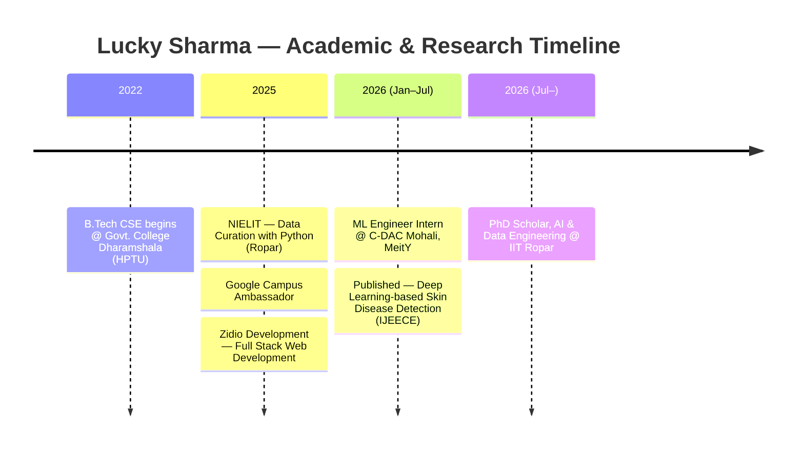

<div align="center">
  
<br/>


<br/><br/>


<br/>

<br/>

<br/>

<br/>

<br/>


<br/><br/>

<a href="https://itsluckysharma01.in/" target="_blank">
  
</a>
&nbsp;
<a href="mailto:itsluckysharma001@gmail.com">
  
</a>
&nbsp;
<a href="https://linkedin.com/in/itsluckysharma01" target="_blank">
  
</a>

<br/><br/>


&nbsp;

&nbsp;


<br/><br/>


---

## 🪪 Profile Card

<table>
<tr>
<td width="40%" valign="top">


<br/><br/>


</td>
<td width="60%" valign="top">

<div align="center">

### 🇮🇳 Lucky Sharma
**PhD Scholar, IIT Ropar** · AI & Data Engineering Researcher


<br/>

| 🎯 | Detail |
|---|---|
| 🎓 | PhD, AI & Data Engineering @ IIT Ropar (July 2026 – Present) |
| 🏛️ | B.Tech CSE, Govt. College Dharamshala (HPTU) |
| 🏢 | Former ML Engineer Intern, C-DAC Mohali (MeitY, Govt. of India) |
| 🧪 | Computer Vision · Domain Adaptation · Transfer Learning · XAI · GenAI |
| 🌍 | Based in India \| Open to Research Collaborations |
| 📫 | itsluckysharma001@gmail.com |

<br/>


</div>

</td>
</tr>
</table>

<br/>

<div align="center">


<br/><br/>


</div>


---

## 🎓 Research Journey




---

## 💫 About Me


<br/>

```yaml
👤  name: Lucky Sharma
🎓  currently: PhD Scholar, AI & Data Engineering @ IIT Ropar
🏢  previously: Machine Learning Engineer Intern @ C-DAC Mohali (MeitY)
🎯  role: AI Researcher | Full Stack Dev | Data Analytics
🌱  researching: Domain Adaptation, Transfer Learning, Explainable AI
🔭  building: Cross-domain generalizable deep learning systems
💬  ask me: Python • PyTorch • Domain Adaptation • React • Node.js
📫  email: itsluckysharma001@gmail.com
⚡  fun fact: "Chai ☕ + Code 💻 + Research 📄 = Pure Happiness 😄"
```

<br/>

### What I'm up to

- 🔬 Researching **Domain Adaptation & Transfer Learning** for robust, cross-domain AI systems at IIT Ropar
- 🧠 Building novel **UDA/PDA frameworks** (e.g., prototypical contrastive & optimal-transport based adaptation) across vision and remote-sensing modalities
- 📄 Published in **IJEECE** on deep learning-based skin disease detection; actively writing new research papers
- 🤝 Open to collaborate on **ML Research, Domain Adaptation & Data Science projects**
- 🛡️ Exploring **Ethical Hacking & Cybersecurity** in spare time
- 🚀 Maintaining a **Modern React Portfolio** — [check it out!](https://itsluckysharma01.in/)

<br/>


---

### 🎯 Current Focus

```
┌─────────────────────────────────────────────────────────────┐
│                                                             │
│   🎓  PhD Research (Domain Adaptation)  ████████████░░  80% │
│   🧠  Deep Learning                     ███████████████ 95% │
│   💻  Full Stack Dev                    ████████████████ 95% │
│   📊  Data Analytics                    ███████████████░ 90% │
│   🔐  Ethical Hacking                   ████████░░░░░░░░ 55% │
│   📝  Research Writing & Publications   ███████████░░░░░ 70% │
│                                                             │
└─────────────────────────────────────────────────────────────┘
```


---

## 🏛️ Experience & Education

<div align="center">

| Period | Role / Program | Organization |
|---|---|---|
| Jul 2026 – Present | **PhD Research Scholar** — AI & Data Engineering | Indian Institute of Technology, Ropar |
| Jan 2026 – Jul 2026 | Machine Learning Engineer Intern (Work-Based Learning) | C-DAC Mohali (MeitY, Govt. of India) |
| Aug 2025 – Jan 2026 | Google Campus Ambassador | Google \| Govt. College Dharamshala |
| Aug 2025 – Nov 2025 | Campus Ambassador, Paranox 2.0 Hackathon | TechXNinjas |
| Sep 2025 – Nov 2025 | Data Science with Python | SmartED Innovations |
| Jun 2025 – Jul 2025 | India-AI: Fundamentals of Data Curation Using Python | NIELIT Ropar |
| May 2025 – Jul 2025 | Web Development (MERN Stack) | Zidio Development |
| Aug 2022 – Jul 2026 | B.Tech, Computer Science Engineering | Govt. College Dharamshala (HPTU) |

</div>


---

## 📄 Publications & 🏅 Certifications

<div align="center">

**📄 Publication**
> *A Comprehensive Analysis of Deep Learning-Based Algorithms for Detection of Skin Diseases* — IJEECE

**🏅 Certifications**


<br/>

<br/>

<br/>

<br/>


</div>


---

## 🏆 GitHub Trophies

<div align="center">
  
  &nbsp;
  
  &nbsp;
  
  &nbsp;
  
  <br/><br/>
  
  &nbsp;
  
  &nbsp;
  
  &nbsp;
  
</div>


---

## ⚡ Fun Animations

<div align="center">
  
  &nbsp;
  
</div>


---

## 🌐 Connect With Me

<div align="center">

<a href="https://linkedin.com/in/itsluckysharma01" target="_blank">
  
</a>
&nbsp;
<a href="https://instagram.com/its_pandit_lucky01">
  
</a>
&nbsp;
<a href="https://facebook.com/its.pandit.lucky01">
  
</a>
&nbsp;
<a href="mailto:itsluckysharma001@gmail.com">
  
</a>
&nbsp;
<a href="https://itsluckysharma01.in/" target="_blank">
  
</a>

</div>


---

## 💻 Tech Stack & Tools

<div align="center">

### 🔤 Languages


### 🎨 Frontend


### ⚙️ Backend & DevOps


### 🗄️ Databases


### 🤖 Data Science, ML & Research


<br/>


### 🛠️ Tools & Platforms


</div>


---

## 🚀 Featured Projects

<div align="center">

<a href="https://itsluckysharma01.in/">
  
</a>
&nbsp;
<a href="https://github.com/itsluckysharma01">
  
</a>

</div>

<br/>

<div align="center">

| 🏗️ Project                 | 🔧 Stack                  | 📄 Description                       |
| -------------------------- | ------------------------- | ------------------------------------ |
| 🧬 **PCSA — Domain Adaptation for Plant Disease Classification** | PyTorch, ResNet-50, UDA | Novel prototypical contrastive subdomain adaptation framework, PlantDoc ↔ PlantVillage |
| 🩺 **AI Clinical Skin Disease Detection** | Python, EfficientNet, Flask, Docker | 30-class classifier, 91% train acc, deployed on Hugging Face Spaces — basis of IJEECE publication |
| 🕵️ **Museum Heist (RL)** | Python, POMDP, BFS, Pygame | Pursuit-evasion AI with belief modeling & live heatmaps |
| 📹 **NETRA Surveillance Platform** | Python, YOLOv8, OpenCV, Flask | Real-time threat detection at 98% accuracy |
| 🌐 **Portfolio Website**   | React, Tailwind, Vercel   | Modern animated developer & research portfolio |

</div>


---

## 📊 GitHub Statistics

<div align="center">


</div>

<div align="center">
  
</div>


---

## 📈 Contribution Graph

<div align="center">
  
</div>


---

## 🔝 Top Contributed Repositories

<div align="center">

| 🏅 Rank | 📂 Repository                                                                  | 🌟 Role            | 🔧 Tech Stack               |
| :-----: | ------------------------------------------------------------------------------ | ------------------ | --------------------------- |
|   🥇    | [**itsluckysharma01**](https://github.com/itsluckysharma01/itsluckysharma01)   | Owner & Maintainer | Markdown, GitHub Actions    |
|   🥈    | [**portfolio-website**](https://github.com/itsluckysharma01/portfolio-website) | Owner & Developer  | React, Tailwind CSS, Vercel |
|   🥉    | [**Domain Adaptation Research**](https://github.com/itsluckysharma01?tab=repositories) | Owner & Researcher | PyTorch, ResNet, UDA/PDA |
|   4️⃣    | [**ML Projects**](https://github.com/itsluckysharma01?tab=repositories)        | Owner & Researcher | Python, PyTorch, TensorFlow |
|   5️⃣    | [**Security Tools**](https://github.com/itsluckysharma01?tab=repositories)     | Owner & Builder    | Python, Networking          |
|   6️⃣    | [**Data Analytics**](https://github.com/itsluckysharma01?tab=repositories)     | Owner & Analyst    | Pandas, NumPy, Streamlit    |

</div>


---

## 🐍 Contribution Snake

<div align="center">
  <picture>
    <source media="(prefers-color-scheme: dark)" srcset="https://raw.githubusercontent.com/itsluckysharma01/itsluckysharma01/output/github-contribution-grid-snake-dark.svg"/>
    <source media="(prefers-color-scheme: light)" srcset="https://raw.githubusercontent.com/itsluckysharma01/itsluckysharma01/output/github-contribution-grid-snake.svg"/>
    
  </picture>
</div>


---

## 💭 Dev & Research Quote of the Day

<div align="center">

> _"First, solve the problem. Then, write the code."_ — John Johnson

> _"Any fool can write code that a computer can understand. Good programmers write code that humans can understand."_ — Martin Fowler

> _"Research is formalized curiosity. It is poking and prying with a purpose."_ — Zora Neale Hurston

</div>


---

## ☕ Support My Work

<div align="center">

<a href="https://buymeacoffee.com/itsluckysharma01" target="_blank">
  
</a>

<br/><br/>

_If you find my projects or research helpful, a ⭐ on any repo means the world to me!_

<br/>


</div>

<div align="center">
  
</div>
